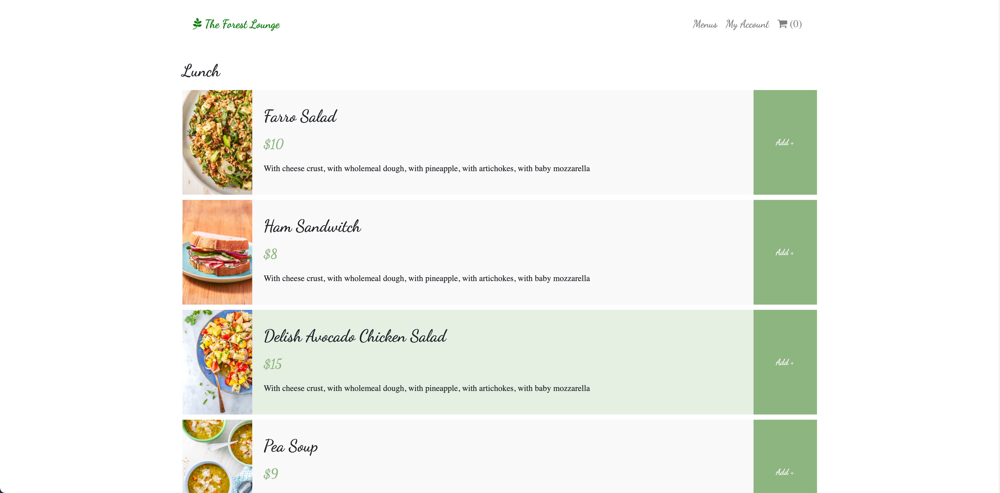
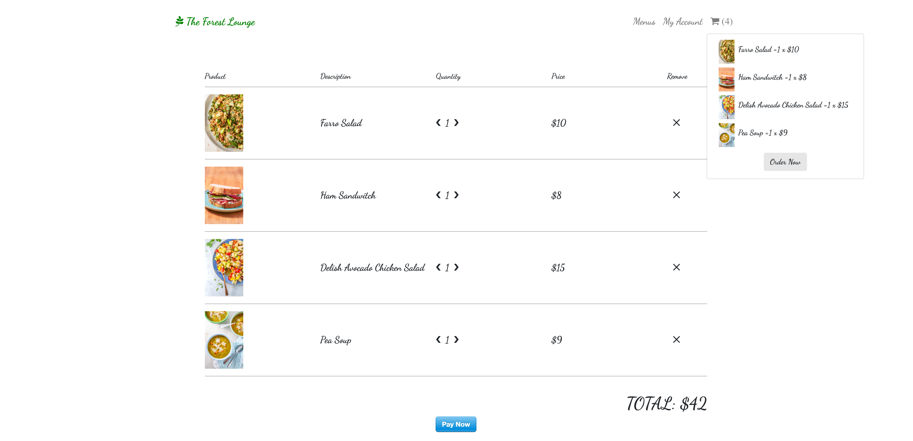

## The Green Lounge
A simple recipe app build with this following technologies :
* [React](https://facebook.github.io/react/)
* [Redux](http://redux.js.org/)
* [Webpack](https://webpack.js.org/)
* [Redux-Persist](https://github.com/rt2zz/redux-persist)
* [Firebase](https://firebase.google.com/)

### Features 
<li>User can browse different menu by category like Lunch, Dinner so on</li>
<li>User can add menu to baseket and edit in checkout</li>
<li>User can sign in either gmail or by email and password</li>
<li>User can pay through stripe API</li>

## Home Page


## Breakfast Menu


## Checkout page and Basket


# Installation and Configuration
Please make sure you have following software installed in your system:
* Node.js
* NPM / Yarn
* Git

Just clone the repository:
```
$ git clone https://github.com/aumtuhin/The-Green-Lounge
```

Then we have to install the necessary dependencies using either NPM or Yarn:
```
$ npm i
```
```
$ yarn start / npm start
```

As we are using Firebase authentication we need to configure our firebase web api key
<li>Go to firebase console</li>
<li>Create a project clicking on Add Project</li>
<li>Go to Authenticaton page from left menu and enable the Email/Password and Google sign-in providers </li>
<li>Copy the firebase config api keys from Firebase SDK Snippet</li>
<li>Go to firebase.utils.js file from src/firebase folder and paste it here as below:</li>

```
const config = {
    apiKey: "",
    authDomain: ",
    projectId: "",
    storageBucket: "",
    messagingSenderId: "",
    appId: "",
    measurementId: ""
};
```

