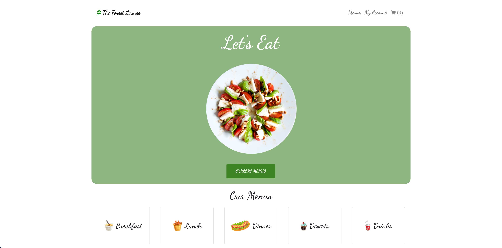

## The Green Lounge
A simple recipe app build with this following technologies :
* [React](https://facebook.github.io/react/)
* [Redux](http://redux.js.org/)
* [Webpack](https://webpack.js.org/)
* [Redux-Persist](https://github.com/rt2zz/redux-persist)
* [Firebase](https://firebase.google.com/)

### Features 
<li>User can browse different menu by category like Lunch, Dinner so on</li>
<li>User can add menu to baseket and edit in checkout</li>
<li>User can sign in either gmail or by email and password</li>
<li>User can pay through stripe API</li>

## Home Page
